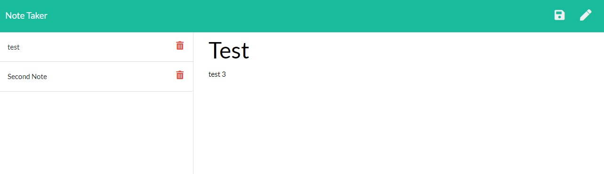

# noteTaker

## Description

This project was a challenge from bootcamp to try and create a note taker application that allows a user to add their notes and see the stored notes.  

## Usage
Screenshot of webpage
    
    

## Repo and Deployed Links
Repository link: https://github.com/hoffh-5334/noteTaker
Deployed link: notetaker-production-d266.up.railway.app

## License

Please refer to the LICENSE in the repo.
